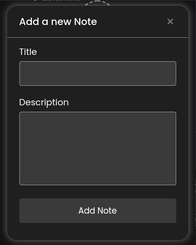
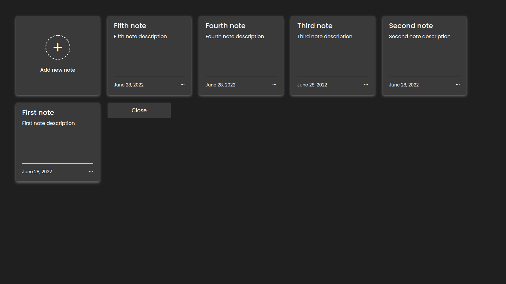

<h1 align="center">NotesTray</h1>

 
  
 
 

Sistem tray para criar notas

  
  
  

## Tray
- Add Note 

- Open Menu 

---
- First Note  > View note  > Remove note
- Second note  > View note  > Remove note
- Third note  > View note  > Remove note
- Fourth Note  > View note  > Remove note
- Fifth Note  > View note  > Remove note
---
- Quit

## Recursos
- Abrir menu pelo tray
- Adicionar notas pelo tray organizadamente
- Adicionar notas pelo menu organizadamente
- Visualizar notas através do tray
- Visualizar notas através do menu
- Remover notas pelo tray
- Remover notas pelo menu

## Dependencias

- :green_heart: [Node.js](https://nodejs.org/en/)
- :blue_heart: [Yarn](https://yarnpkg.com/pt-BR/docs/install) ou [NPM](https://nodejs.org/en/)
- :electron: **Electron**
- :heart: **JsonFile-Promised**

## Download e Instalação

Para visualizar as versões basta, [clicar aqui!](https://github.com/CaioTakabatake/notes-tray/releases)

### Compatibilidade
- Windows
- Linux
- MacOS

---

## Iniciando

1. Clone o repositório `git clone https://github.com/CaioTakabatake/notes-tray.git`;
2. `cd notes-tray`;
3. Utilize `yarn install` ou `npm update` para instalar as dependecias.
4. Utilize `yarn start` ou `npm start` para iniciar o tray.

## License

This project is licensed under the MIT License - see the [LICENSE.md](LICENSE.md) file for details.